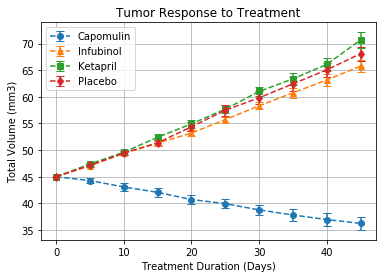
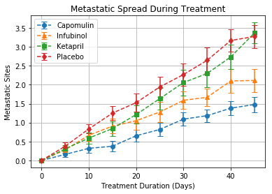
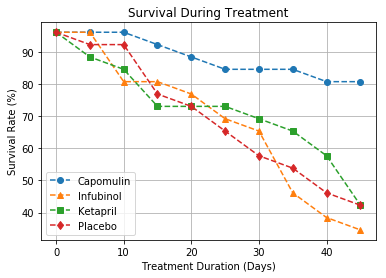
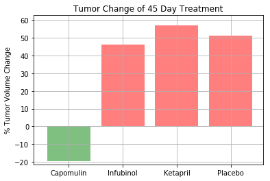

# Pymaceuticals

## Purpose
This jupyter notebook analyzes trends in data from experimental trials of chemotherapy drugs used to treat tumors in mice. This data is included in the csv files clinicaltrial_data.csv and mouse_drug_data.csv.

clinicaltrial_data.csv contains columns with the following information: Mouse ID, Timepoint, Tumor Volume (mm3), and Metastatic Sites.

mouse_drug_data contains columns with the following information: Mouse ID and Drug.

experimental_analysis.ipynb merges the data from the two csv files using the Mouse ID, and uses matplotlib to show the trends for the tumor volume in cubic mm, the number of metastatic sites, and the survival rate over the course of the experiment. It also includeds a bar graph to show the mean % change in tumor volume for each drug over the course of the study.

## Requirements
This notebook requires python to be installed. Python 3.6.2 was used during development. The pandas library used to store, manipulate, filter, merge and perform calculations with the data. The matplotlib and numpy libraries were used to generate the plots showing the trends of various parameters over the course of the study. The jupyter library was used to execute the python code and display results.
All required libraries can be found in requirements.txt and installed with the following command:
`pip install requirements.txt -r`

## Running the Code
To run the notebook enter the following into the command line: 
`$ jupyter notebook`
Open up the experimental_analysis.ipynb notebook in your browser and then click the 'Kernal' and the 'Restart and run all option'

## Methods
This notebook relies heavily on the summary statstical functions built into pandas such as sum, max, describe, and nunique.
It also utilizes pandas indexing,sorting and grouping functions such as loc, iloc, sort_values, and groupby. 

## Results
```python
#import libraries
import os
import pandas as pd
import numpy as np
import matplotlib.pyplot as plt
```


```python
#read files
file_name_data = "clinicaltrial_data.csv"
file_name_drugs = "mouse_drug_data.csv"

file_path_data = os.path.join("raw_data",file_name_data)
file_path_drugs = os.path.join("raw_data",file_name_drugs)

clinical_trials_df = pd.read_csv(file_path_data)
drugs_df = pd.read_csv(file_path_drugs)

view_clinical_trials = clinical_trials_df.head()
view_drugs = drugs_df.head()

print(view_clinical_trials)
print(view_drugs)
```

      Mouse ID  Timepoint  Tumor Volume (mm3)  Metastatic Sites
    0     b128          0                45.0                 0
    1     f932          0                45.0                 0
    2     g107          0                45.0                 0
    3     a457          0                45.0                 0
    4     c819          0                45.0                 0
      Mouse ID      Drug
    0     f234  Stelasyn
    1     x402  Stelasyn
    2     a492  Stelasyn
    3     w540  Stelasyn
    4     v764  Stelasyn
    


```python
#merge dataframes
merged_df = pd.merge(clinical_trials_df,drugs_df,on='Mouse ID')
merged_df.head()
```


<div>
<style>
    .dataframe thead tr:only-child th {
        text-align: right;
    }

    .dataframe thead th {
        text-align: left;
    }

    .dataframe tbody tr th {
        vertical-align: top;
    }
</style>
<table border="1" class="dataframe">
  <thead>
    <tr style="text-align: right;">
      <th></th>
      <th>Mouse ID</th>
      <th>Timepoint</th>
      <th>Tumor Volume (mm3)</th>
      <th>Metastatic Sites</th>
      <th>Drug</th>
    </tr>
  </thead>
  <tbody>
    <tr>
      <th>0</th>
      <td>b128</td>
      <td>0</td>
      <td>45.000000</td>
      <td>0</td>
      <td>Capomulin</td>
    </tr>
    <tr>
      <th>1</th>
      <td>b128</td>
      <td>5</td>
      <td>45.651331</td>
      <td>0</td>
      <td>Capomulin</td>
    </tr>
    <tr>
      <th>2</th>
      <td>b128</td>
      <td>10</td>
      <td>43.270852</td>
      <td>0</td>
      <td>Capomulin</td>
    </tr>
    <tr>
      <th>3</th>
      <td>b128</td>
      <td>15</td>
      <td>43.784893</td>
      <td>0</td>
      <td>Capomulin</td>
    </tr>
    <tr>
      <th>4</th>
      <td>b128</td>
      <td>20</td>
      <td>42.731552</td>
      <td>0</td>
      <td>Capomulin</td>
    </tr>
  </tbody>
</table>
</div>


```python
#find mean tumor volume, mean number of metastic sites, and total number of surviving mice over time for each treatment
groubpy_drug_time_tumor_volume = merged_df.groupby(by = ["Drug","Timepoint"]).mean()["Tumor Volume (mm3)"]
groupby_drug_time_num_sites = merged_df.groupby(by = ["Drug","Timepoint"]).mean()["Metastatic Sites"]
groupby_drug_time_num_mice = merged_df.groupby(by = ["Drug","Timepoint"]).size()

#save results to dataframe
results = pd.DataFrame()
results["Tumor Volume (mm3)"] = groubpy_drug_time_tumor_volume
results["Metastatic Sites"] = groupby_drug_time_num_sites
results["Mouse Count"] = groupby_drug_time_num_mice
results.head()
```


<div>
<style>
    .dataframe thead tr:only-child th {
        text-align: right;
    }

    .dataframe thead th {
        text-align: left;
    }

    .dataframe tbody tr th {
        vertical-align: top;
    }
</style>
<table border="1" class="dataframe">
  <thead>
    <tr style="text-align: right;">
      <th></th>
      <th></th>
      <th>Tumor Volume (mm3)</th>
      <th>Metastatic Sites</th>
      <th>Mouse Count</th>
    </tr>
    <tr>
      <th>Drug</th>
      <th>Timepoint</th>
      <th></th>
      <th></th>
      <th></th>
    </tr>
  </thead>
  <tbody>
    <tr>
      <th rowspan="5" valign="top">Capomulin</th>
      <th>0</th>
      <td>45.000000</td>
      <td>0.000000</td>
      <td>25</td>
    </tr>
    <tr>
      <th>5</th>
      <td>44.266086</td>
      <td>0.160000</td>
      <td>25</td>
    </tr>
    <tr>
      <th>10</th>
      <td>43.084291</td>
      <td>0.320000</td>
      <td>25</td>
    </tr>
    <tr>
      <th>15</th>
      <td>42.064317</td>
      <td>0.375000</td>
      <td>24</td>
    </tr>
    <tr>
      <th>20</th>
      <td>40.716325</td>
      <td>0.652174</td>
      <td>23</td>
    </tr>
  </tbody>
</table>
</div>


```python
#get standard error for tumor volume and number of metastic sites over time for each treatment
results["Tumor Volume SEM"] = merged_df.groupby(by = ["Drug","Timepoint"]).sem()["Tumor Volume (mm3)"]
results["Metastatic Sites SEM"] = merged_df.groupby(by = ["Drug","Timepoint"]).sem()["Metastatic Sites"]
results.head()
```


<div>
<style>
    .dataframe thead tr:only-child th {
        text-align: right;
    }

    .dataframe thead th {
        text-align: left;
    }

    .dataframe tbody tr th {
        vertical-align: top;
    }
</style>
<table border="1" class="dataframe">
  <thead>
    <tr style="text-align: right;">
      <th></th>
      <th></th>
      <th>Tumor Volume (mm3)</th>
      <th>Metastatic Sites</th>
      <th>Mouse Count</th>
      <th>Tumor Volume SEM</th>
      <th>Metastatic Sites SEM</th>
    </tr>
    <tr>
      <th>Drug</th>
      <th>Timepoint</th>
      <th></th>
      <th></th>
      <th></th>
      <th></th>
      <th></th>
    </tr>
  </thead>
  <tbody>
    <tr>
      <th rowspan="5" valign="top">Capomulin</th>
      <th>0</th>
      <td>45.000000</td>
      <td>0.000000</td>
      <td>25</td>
      <td>0.000000</td>
      <td>0.000000</td>
    </tr>
    <tr>
      <th>5</th>
      <td>44.266086</td>
      <td>0.160000</td>
      <td>25</td>
      <td>0.448593</td>
      <td>0.074833</td>
    </tr>
    <tr>
      <th>10</th>
      <td>43.084291</td>
      <td>0.320000</td>
      <td>25</td>
      <td>0.702684</td>
      <td>0.125433</td>
    </tr>
    <tr>
      <th>15</th>
      <td>42.064317</td>
      <td>0.375000</td>
      <td>24</td>
      <td>0.838617</td>
      <td>0.132048</td>
    </tr>
    <tr>
      <th>20</th>
      <td>40.716325</td>
      <td>0.652174</td>
      <td>23</td>
      <td>0.909731</td>
      <td>0.161621</td>
    </tr>
  </tbody>
</table>
</div>


```python
#plot tumor volume changes over time for each treatment
#user scatter plot with error bars
time = [0,5,10,15,20,25,30,35,40,45]
drug_list = ['Capomulin','Infubinol','Ketapril','Placebo']
marker_list = ['o','^','s','d']
handles = []
labels = []
for i in range(len(drug_list)):
    handle = plt.errorbar(time,results.loc[drug_list[i]]["Tumor Volume (mm3)"],yerr = results.loc[drug_list[i]]["Tumor Volume SEM"],linestyle = '--',capsize = 4,marker=marker_list[i])
    handles.append(handle)
    labels.append(drug_list[i])
plt.xlabel('Treatment Duration (Days)')
plt.ylabel('Total Volume (mm3)')
plt.title('Tumor Response to Treatment')
plt.grid(True)
plt.legend(handles,labels)
plt.show()
```





```python
#plot number of metastic sites over time for each treatment
#user scatter plot with error bars
handles = []
labels = []
for i in range(len(drug_list)):
    handle = plt.errorbar(time,results.loc[drug_list[i]]["Metastatic Sites"],yerr = results.loc[drug_list[i]]["Metastatic Sites SEM"],linestyle = '--',capsize = 4,marker=marker_list[i])
    handles.append(handle)
    labels.append(drug_list[i])
plt.xlabel('Treatment Duration (Days)')
plt.ylabel('Metastatic Sites')
plt.title('Metastatic Spread During Treatment')
plt.grid(True)
plt.legend(handles,labels)
plt.show()
```





```python
#plot number of surviving mice over time for each treatment
#user scatter plot with error bars
handles = []
labels = []
survival_rate = results["Mouse Count"]/max(results["Mouse Count"])*100
for i in range(len(drug_list)):
    handle, = plt.plot(time,survival_rate.loc[drug_list[i]],linestyle = '--',marker=marker_list[i])
    handles.append(handle)
    labels.append(drug_list[i])
plt.xlabel('Treatment Duration (Days)')
plt.ylabel('Survival Rate (%)')
plt.title('Survival During Treatment')
plt.grid(True)
plt.legend(handles,labels)
plt.show()
```





```python
#find total % tumor volume change for each treatment over 45 day study
tumor_change = []
for i in range(len(drug_list)):
    num_time_points = len(results.loc[drug_list[i]]["Tumor Volume (mm3)"])-1
    tumor_start = results.loc[drug_list[i]]["Tumor Volume (mm3)"].iloc[0]
    tumor_end = results.loc[drug_list[i]]["Tumor Volume (mm3)"].iloc[num_time_points]
    percent_change = (tumor_end-tumor_start)/tumor_start*100
    tumor_change.append(percent_change)
    
tumor_change = np.array(tumor_change)
tumor_change
```


    array([-19.47530267,  46.12347173,  57.02879469,  51.29796048])


```python
#plot % tumor volume change for each treament over 45 day study
#use bar graph
x = np.arange(len(tumor_change))
plt.bar(x[tumor_change<0], tumor_change[tumor_change<0], color='g', alpha=0.5, align="edge")
plt.bar(x[tumor_change>0], tumor_change[tumor_change>0], color='r', alpha=0.5, align="edge")
plt.ylabel('% Tumor Volume Change')
plt.title('Tumor Change of 45 Day Treatment')
plt.grid(True)
plt.xlim(-0.25, len(x))
plt.ylim(tumor_change.min()*1.1,tumor_change.max()*1.1)
tick_locations = [value+0.4 for value in x]
plt.xticks(tick_locations, drug_list)
plt.show()
```





## Observable Trends

1) All of the drugs used in the trial had an increase in metastatic sites over the course of the study.
2) All of the drugs used in the trial had a decrease in survival rate over the course of the study.
3) Only Capomulin had a decrease in tumor volume of the course of the study.
